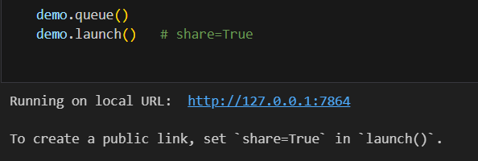

## Source Code for GPTTransit

### Jupyter Notebook
All codes were written & run on a Python notebook "GPTTransit_Application_v4.ipynb".

Key packages required were listed in `requirements.txt` in the `root` folder, as well as written as `pip install` commands within "Part 1" of the notebook.

*Note*: All codes were run locally on a Windows machine

### Setting up
1. Create a `.env` file in the same path as the notebook, containing:
```
OPENAI_API_KEY = "YOUR_API_KEY" 
HUGGINGFACEHUB_API_TOKEN = "YOUR_API_KEY" 
LTA_API_KEY = "YOUR_API_KEY" 
ONEMAP_API_KEY = "YOUR_API_KEY" 
```
2. Ensure that all downloaded datasets are in the same folder / path as the notebook.
3. Run the entire notebook
4. Under "Part 4: Gradio Chatbot User Interface", click on the link to launch the Gradio frontend platform. 

5. Chat away!