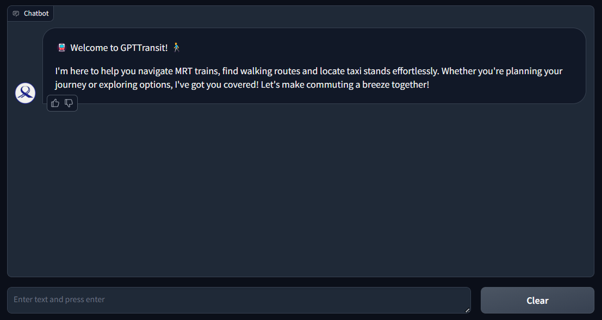

# GPTTransit Generative AI Application

This repository contains the GPTTransit application, a personalised chatbot agent designed to help users navigate public transportation in Singapore.

GPTTransit is developed by Team Green Path Traffic as part of the NUS-NCS Innovation Challenge and won 1st runner up among 80+ participating teams.

## Objective
- **Vision & Alignment**: The app is guided by the vision "Making travel a breeze with TransportGPT" and aligns with the Land Transport Master Plan 2040's goals for inclusive infrastructure.
- **Technology**: Utilizes Generative AI and Large Language Models (LLMs).
- **Purpose**: Facilitates personalized travel planning.
- **Innovative Approach**: Redefines the idea that the shortest route is the best.
- **User-Centric**: Aims to provide reliable, accurate, and diversified public transport solutions for all travellers.

## Features
- Core Technologies: GPT-4.0 LLM, LangChain, OpenAI Tool agents, OneMap & LTA DataMall API.
- Personalized Recommendations: Tailors travel advice based on individual needs, such as less crowded routes for seniors.
- Weather Integration: Considers weather forecasts to promote walking and aligns with Health Promotion Board's Healthier SG initiative.
- Real-Time Updates: Provides alternative routes and transport modes during train disruptions and traffic issues.
- Quality Assurance: Includes frameworks for guardrails to focus on transport-related queries and feedback mechanisms to enhance performance and accuracy.
- A video demostration of the chatbot can be found here: [YouTube](https://youtu.be/QmAEUj__Wk0?si=kXeMk0T_NFih1_yP).



## Repository
- "ExecutiveSummary_GPTTransit.pdf": Summary of the project & it's core features

```
GPTTransit/
│
├── config/            # Configuration settings
├── data/              # Data files (MRT station info, taxi stands)
├── utils/             # Utility functions
├── api/               # API clients for external services
├── tools/             # LangChain tools for the agent
├── llm/               # LLM models, prompts, agent setup
├── ui/                # Gradio user interface
├── assets/            # UI assets (images, etc.)
│
├── main.py            # Application entry point
└── requirements.txt   # Project dependencies
```

## Installation

1. Clone the repository

2. Create a virtual environment (optional but recommended):
   ```
   python -m venv gpt_transit
   gpt_transit\Scripts\activate  # On Windows
   ```

3. Install dependencies:
   ```
   pip install -r requirements.txt
   ```

4. Create a `.env` file in the root directory with your API keys:
   ```
   OPENAI_API_KEY=your_openai_key
   HUGGINGFACEHUB_API_TOKEN=your_huggingface_key
   LTA_API_KEY=your_lta_key
   ONEMAP_API_KEY=your_onemap_key
   ```

## Running the Application

Run the application with:

```
python main.py
```

By default, the application runs on `http://localhost:7860`.

For additional options:

```
python main.py --help
```

## License

This project is licensed under the Apache 2.0 License - see the LICENSE file for details.
